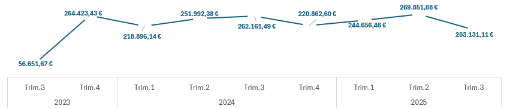
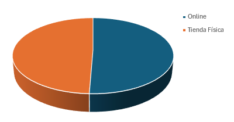
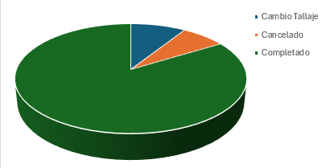

Análisis de Ventas y Beneficios: Exploración y Modelado de Datos ZARA 👔

Este proyecto consta con un análisis exporatorio y predictivo centrado en las compras realizadas en ZARA
entre 2023 y 2025 (inclusives). El objetivo es realizar posibles predicciones de cara a futuras campañas de marketing
e identificar puntos clave dónde mejorar, basándonos en datos históricos usando técnicas de modelado estadístico.

🗻 Estructura del Proyecto:

-  data/ # Datos crudos
-  img/ # Imágenes usadas en el README.md
-  results/ # archivo de resultados con DB interactivo
-  README.md # Descripción del proyecto

Este proyecto no requiere librerías ni dependencias externas.
El único requisito es tener instalado Microsoft Excel (versión 2016 o superior) o cualquier software compatible con archivos .xlsx.

📈 Resultados y Conclusiones:

- Identificamos que las mujeres son responsables del 59,65% ( 995.557 € ) de los beneficios totales ( 1.668.719 € ).

- El tallaje más y menos adquirido por género serían los siguientes:

    - Hombre: ➕ M / ➖ XXL
    - Mujer: ➕ XS / ➖ XXL
    - No Especificado: ➕ M / ➖ XXL

- Se puede comprobar que las provincias más fieles a la compañía por año han sido:

    - 2023: Oviedo
    - 2024: Bilbao
    - 2025: Oviedo 

- Se analiza que los trimestres más "fuertes" del año suelen coincidir con las campañas de inicio de verano y navidades.

    

- La diferencia entre compras online y en tienda física van fluctuando con el tiempo pero ambas parecen ir de la mano.

    

- En los tipos de estado predominan los pedidos completados, aunque hay un porcentaje llamaito de pedidos "Cambio de Tallaje". 
    
    

📖 Próximos Pasos:

Teniendo en cuenta que este análisis está hecho con datos fictícios generados de manera aleatória teniendo en cuenta una secuencia de parámetros, la idea a futuro sería poder aplicar la metodología implementada en datos reales sobre las ventas y beneficios oficiales de ZARA e incluso realizar comparaciones con diversas franquicias de Inditex.

- Óscar Casanova
- [@OscarCasahe](https://github.com/OscarCasahe)